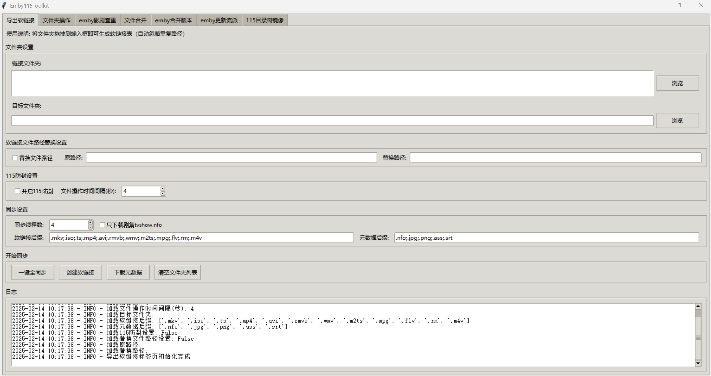
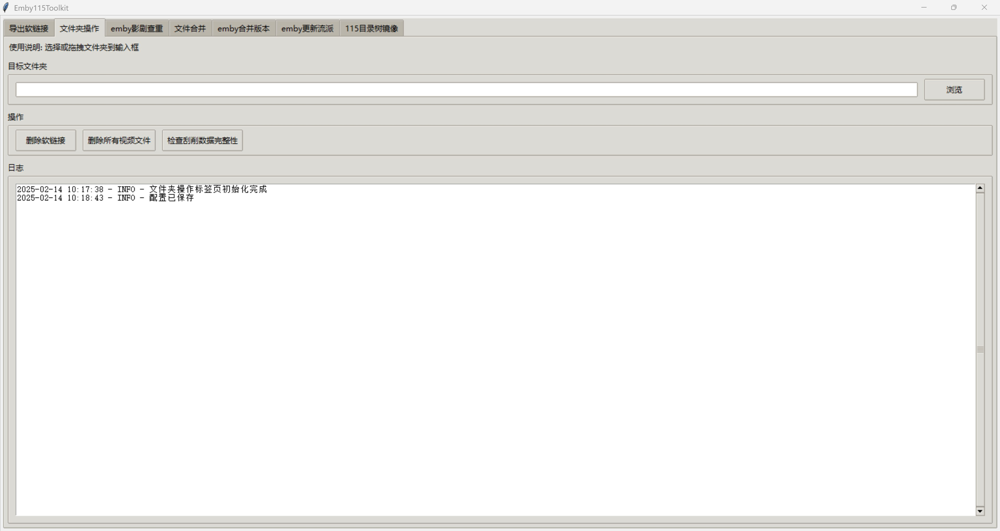
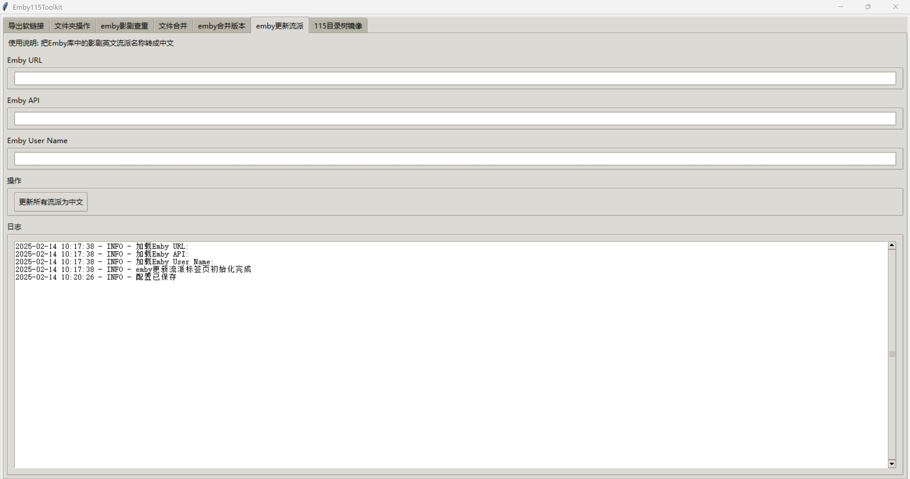
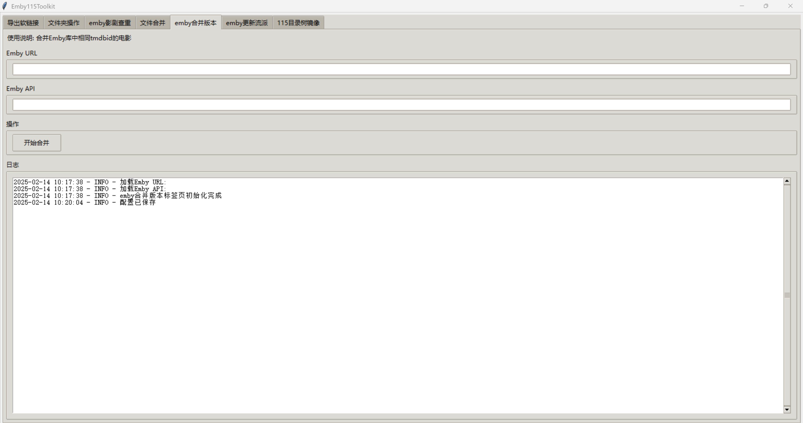
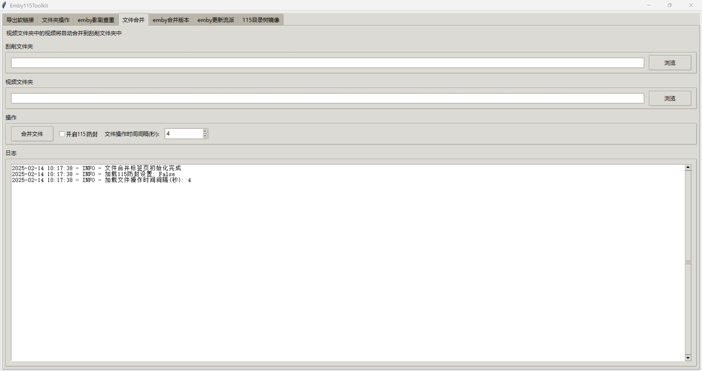
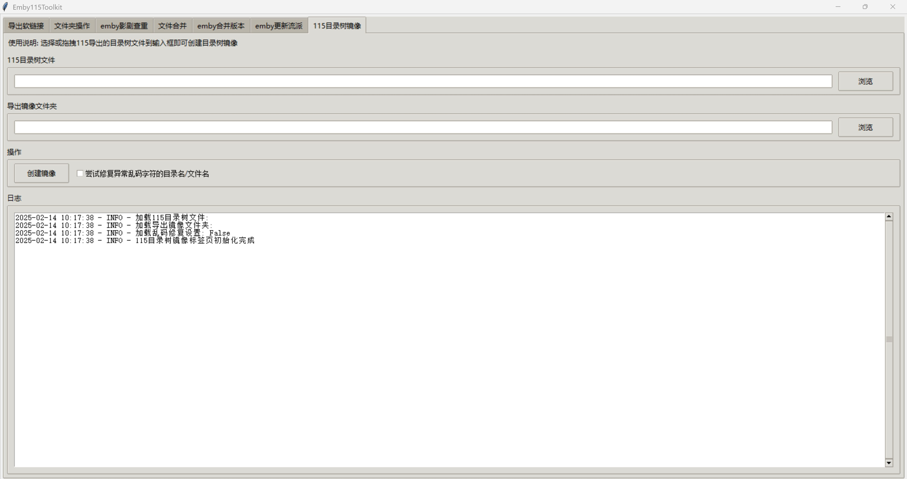

更多交流和技术讨论，请加群：https://t.me/embyfans

# Emby115Toolkit

针对115网盘 + CloudDrive2 + Emby 优化的实用工具，在 Windows / macOS / Linux 中运行。
V2 WebUI / CLI 已支持 Windows、macOS 与 Linux；旧版 tkinter GUI 主要为 Windows 设计，macOS 用户可使用 V2 WebUI 或遗留的 `emby115_v1/qt_main.py`。

## 我的环境

- Windows / Linux / macOS 系统
- Python 3.x
- Windows 主机：挂载 CloudDrive2 并运行 Emby Server（macOS / Linux 请使用本地目录或兼容挂载方案）
- 播放端推荐：Apple TV + Infuse播放器

## 主要功能

### 1. 导出软链接
- 支持多文件夹批量创建软链接
- 支持元数据文件自动复制（nfo, jpg等）
- 支持多线程并行处理
- 支持路径替换功能，以不访问115网盘的方式本地创建海量软链接文件
- 可自定义软链接和元数据文件的后缀

### 2. 文件夹操作
- 删除软链接
- 删除所有视频文件
- 检查刮削数据完整性: 检查指定目录下所有视频文件是否有对应的nfo文件， 所有nfo文件是否有对应的视频文件

### 3. 媒体库管理
- 版本合并：支持 Emby/Jellyfin，自动合并相同TMDB ID的影片
- 流派更新：将英文流派名称转换为中文

### 4. 文件合并
- 对于已经完成刮削的影视元数据，支持扫描两个文件夹， 当扫描到同名nfo和视频文件，则移动视频文件到同名的nfo文件夹下
    使用场景：
    根据本地生成的软链接或者镜像树视频文件刮削完影剧的元数据后，
        元数据目录： c:\metadata\movie， 目录中有文件 fly (2025)\fly.2025.2160.dv.nfo， fly (2025)\fly.2025.2160.dv-post.jpg
        视频文件目录： c:\download,     目录中有文件 fly.2025.2160.dv.mkv

    文件合并后： c:\metadata\movie 目录下： fly (2025)\fly.2025.2160.dv.nfo，fly (2025)\fly.2025.2160.dv.mkv, fly (2025)\fly.2025.2160.dv-post.jpg

### 5. 115目录树镜像
扫描从115官方导出的目录树文件，在PC本地生成目录树镜像（都是空文件），方便后续生成软链接，以及刮削工具使用

### 6 最实用的功能介绍: 115网盘中PB级别的海量影剧数据如何10分种生成所有软链接
1. 使用115浏览器导出目录树
2. 使用"115目录树镜像"功能在本地生成空文件树
3. 使用"导出软链接"功能，配置路径替换：
   - 选择本地镜像文件夹
   - 选择目标文件夹
   - 启用"软链接路径替换设置"
   - 设置原路径和替换路径
   - 建议：通过“路径替换”的方式创建软链接前先卸载115本地盘挂载，等到完成导出软链接操作后，再重新挂载115本地盘， 这是因为创建软链接时操作系统会监测该软链接指向的目标文件是否存在（但即使目标文件不存在，软链接依然能成功创建）

例如：

如果115网盘的cd挂载在本地的d盘，

电影路径为: "d:\115\video\movie"

而通过导出的目录树生成的本地镜像文件夹为: "c:\mirro\movie"

则勾选上"替换文件路径"，原路径填写： "c:\mirro\movie" ， 替换路径填写： "d:\115\video\movie"

点击"创建软链接"，程序会自动退出后重新以管理员模式权限运行，

卸载115本地盘挂载，然后点击"创建软链接"， 就能快速创建所有的软链接文件，

可以使用多线程加快创建软链接文件的速度，

等到"导出软链接"操作结束后，重新挂载115本地盘。

## 使用方法

下载代码到本地，然后 cd Emby115Toolkit 目录

V2 WebUI（Windows / macOS / Linux）：

1. 安装依赖：`pip install -r requirements.txt`

2. 一键启动后端并打开网页：Windows 双击 `scripts/start_webui.bat`，macOS / Linux 执行 `./scripts/start_webui.sh`

3. 或手动启动：`python main.py --serve-web`

Windows系统：

1. 安装依赖：  pip install -r requirements.txt

2. 运行程序:   python main.py

Ubuntu系统：

1. 安装依赖包：

    sudo apt install python3-pip

    sudo apt install python3-tkinter

    sudo apt-get install python3-tk

    pip3 install ttkthemes

    pip3 install tkinterdnd2

   
3. 运行程序

   python3 main.py

致谢： 项目中使用了shenxianmq的MediaHelper项目（https://github.com/shenxianmq/MediaHelper）的部分代码，感谢shenxianmq!
